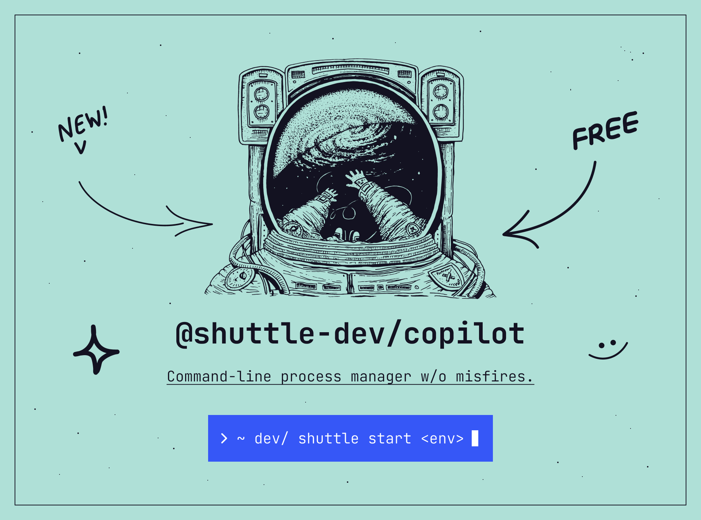

# @shuttle-dev/copilot

@shuttle-dev/copilot is a command-line process manager by shuttle™ that allows you to manage and launch your development environments from the command-line without hassle.

````shell
> ~ dev/ shuttle launch <env>
````

## What is shuttle

shuttle is a developer-focused project management software that connects everyone in strategy & planning
so teams can deliver better results, faster ✊ shuttle is currently under development and will be available around summer 2022.

---

# Documentation

+ [Installation](#installation)
+ [Usage](#usage)
  + [Commands](#commands)
    + [Menu](#menu)
    + [Create](#create)
    + [Start](#start)
    + [List](#list)
    + [Config](#config)
    + [Help](#help)
---

## Installation

````shell
npm install -g @shuttle-dev/copilot
````

## Usage

Once installed, you can invoke CLI commands directly from the command-line of your operating system using the shuttle executable. To list available shuttle commands, type the following:

````shell
> ~ dev/ shuttle --help
````

You can get help on a single command by using the following construct. Substitute any command, such as `menu`, `launch`, `...` where `env` appears in the example below to get detailed help on that command:

````shell
> ~ dev/ shuttle env --help
````

## Commands

TBD
